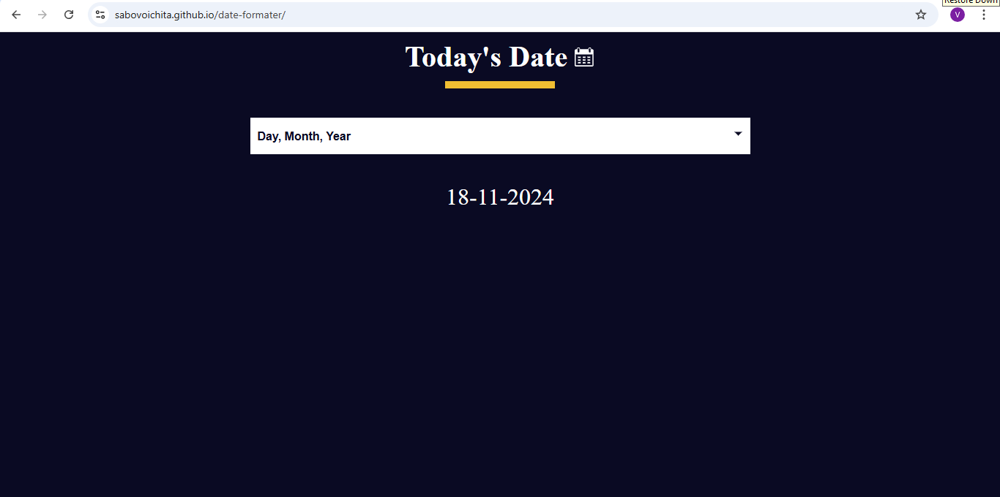

# Date Formater

In this project, you'll learn how to work with the JavaScript Date object, including its methods and properties. You'll also learn how to correctly format dates. This project will cover concepts such as the getDate(), getMonth(), and getFullYear() methods.

[link](https://sabovoichita.github.io/date-formater/)

